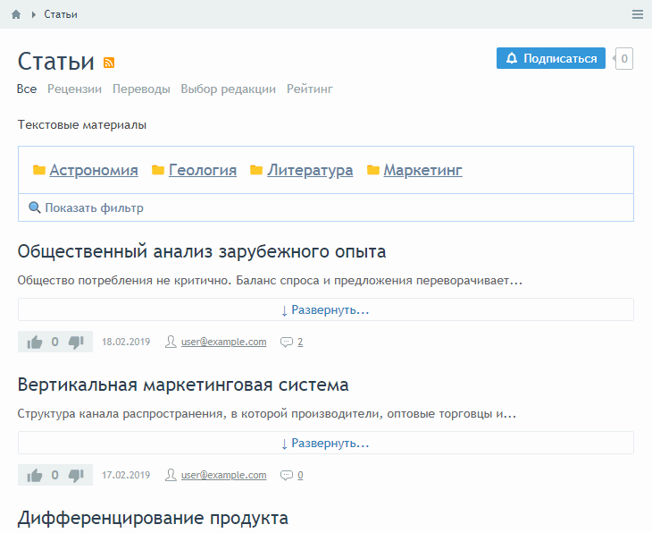
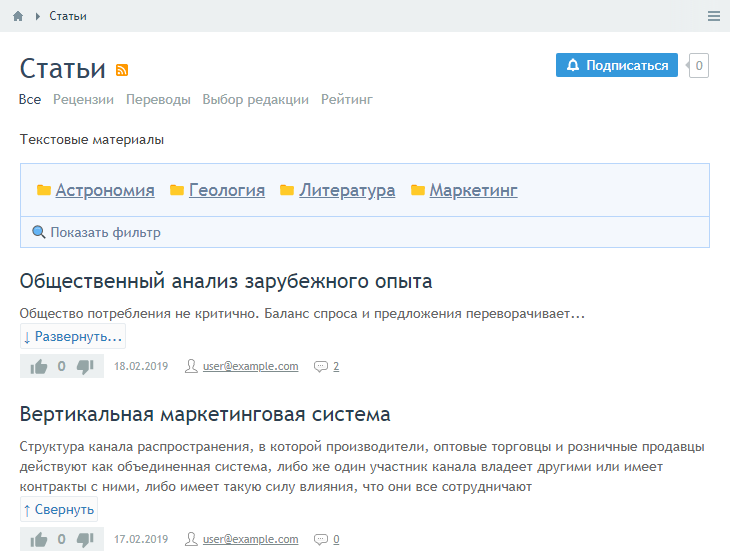
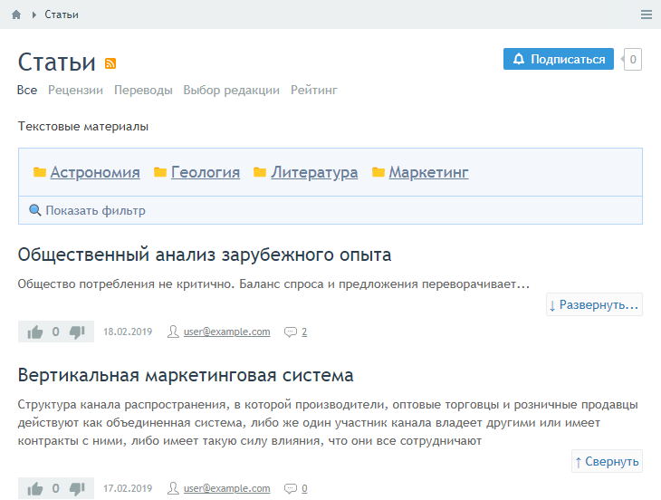
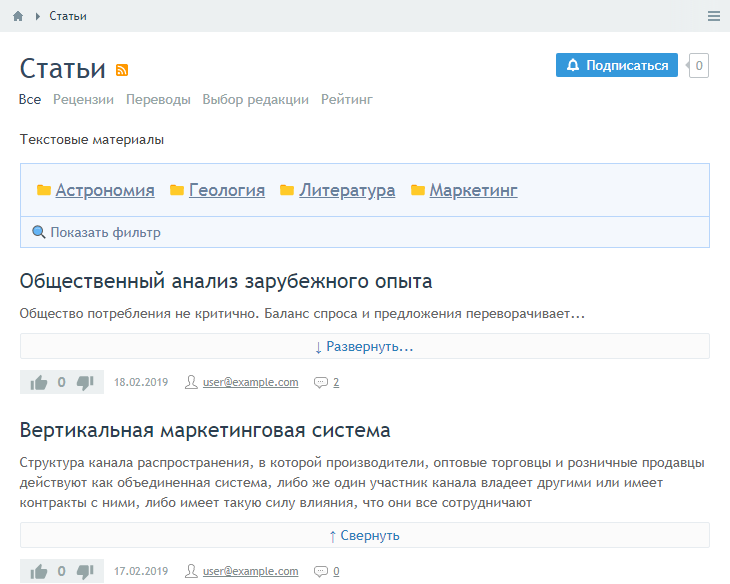

# instantcms_readmore_wg
Виджет ReadMore для InstantCMS  

**_Виджет добавляет функциональность Свернуть/Развернуть к блокам, к которым применяется._** 

  
  
  
  
  

Тест на InstantCMS \*v2.10.0\*  

Сделано пользоватем https://instantcms.ru/users/12494
vladimilin500278347@gmail.com
js от georapbox
------
как определить селектор? (подсказки) - https://www.w3schools.com/cssref/trysel.asp?selector=pluss  

Донат автору - PrivatBank EUR - 4149 4993 7413 7113 MonoBank EUR - 5375 4199 1067 8257
